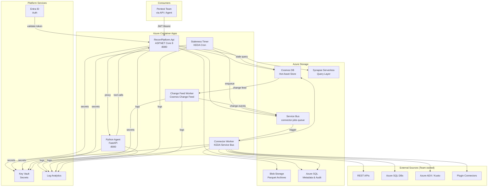
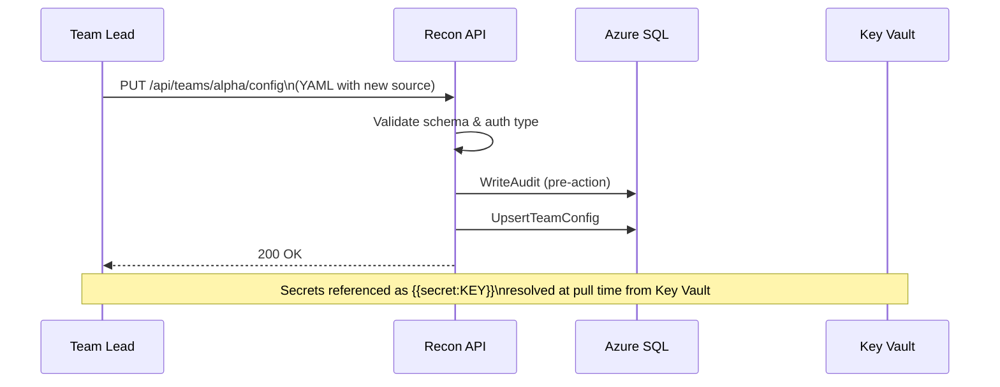
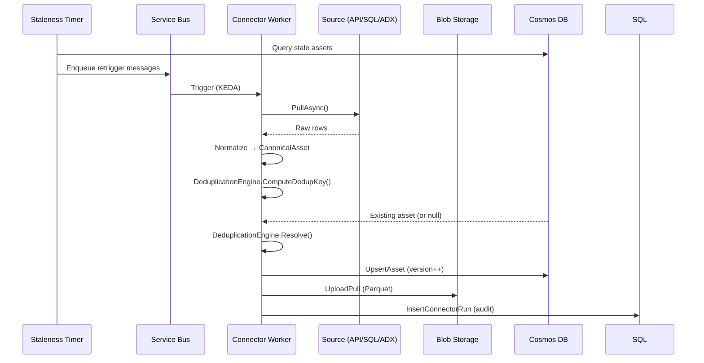
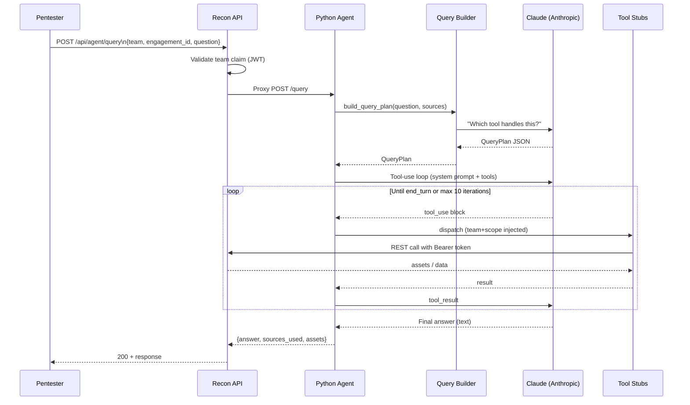
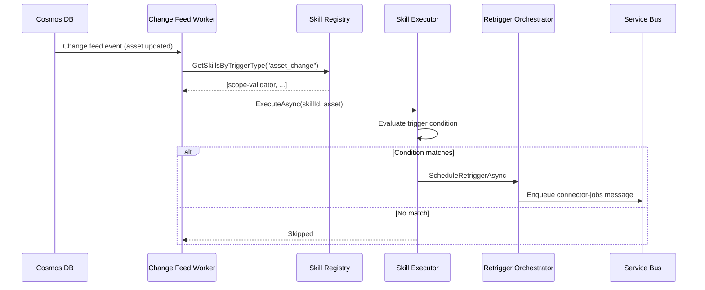
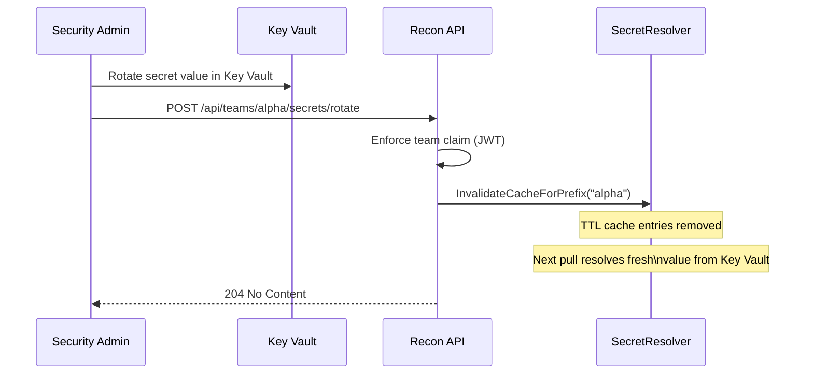

# Recon Intelligence Platform

[](https://github.com/your-org/recon-platform/actions/workflows/ci.yml)
[](https://dotnet.microsoft.com/download/dotnet/8.0)
[](https://www.python.org/)
[](https://azure.microsoft.com/en-us/products/container-apps)

A configuration-driven platform for enterprise penetration testing teams to aggregate, version, deduplicate, and query reconnaissance data from multiple internal sources, with an AI agent interface for natural language queries.

---

## What is this?

The Recon Intelligence Platform lets penetration testing teams register their data sources (REST APIs, Azure SQL, Azure Data Explorer, custom plugins) via YAML configuration — no code deployments needed for common cases. Scheduled and ad-hoc connector pulls ingest assets into a versioned store, deduplicating across sources using configurable match keys. An AI agent backed by Claude answers natural language recon questions within the strict scope of the active engagement.

---

## Architecture



---

## Quick Start

Get running locally in 5 commands:

```bash
# 1. Clone and build
git clone https://github.com/your-org/recon-platform.git && cd recon-platform
dotnet build ReconPlatform.sln --configuration Release

# 2. Start local Azure emulators
docker compose up -d

# 3. Configure local environment
cp .env.example .env  # then edit .env with your values (see docs/setup.md)

# 4. Start the API
dotnet run --project src/ReconPlatform.Api

# 5. Start the Python agent (new terminal)
cd agent && pip install -r requirements.txt && uvicorn main:app --reload --port 8000
```

API Swagger UI: `http://localhost:5000/swagger`
Agent Swagger UI: `http://localhost:8000/docs`
Health check: `curl http://localhost:5000/api/health`

See [docs/setup.md](docs/setup.md) for the complete setup guide including VS Code extensions, Docker configuration, and common troubleshooting.

---

## Key Scenarios

### Scenario 1: Team Registers a New Data Source



### Scenario 2: Scheduled Pull and Deduplication



### Scenario 3: Agent Answers a Pentest Query



### Scenario 4: Asset Change Triggers a Skill



### Scenario 5: Secret Rotation



---

## Project Structure

```
ReconPlatform.sln
├── src/
│   ├── ReconPlatform.Api/          # ASP.NET Core 8 Web API — all HTTP endpoints
│   │   ├── Controllers/            # Teams, Recon, Engagements, Skills, Agent, Health
│   │   ├── Middleware/             # AuditLoggingMiddleware, SecretScrubMiddleware
│   │   └── Program.cs             # DI registration, auth config, middleware pipeline
│   ├── ReconPlatform.Connectors/   # Connector framework — REST, SQL, ADX, Plugin
│   │   ├── Interfaces/IConnector.cs
│   │   ├── RestApiConnector.cs
│   │   ├── AzureSqlConnector.cs
│   │   ├── AzureAdxConnector.cs
│   │   └── PluginLoader.cs
│   ├── ReconPlatform.Engine/       # Core business logic — dedup, diff, normalizer
│   │   ├── DeduplicationEngine.cs
│   │   ├── DiffEngine.cs
│   │   ├── Normalizer.cs
│   │   ├── RetriggerOrchestrator.cs
│   │   └── StalenessChecker.cs
│   ├── ReconPlatform.Storage/      # Azure storage clients
│   │   ├── BlobStorageClient.cs    # Parquet archive writes
│   │   ├── CosmosDbClient.cs       # Hot asset store
│   │   ├── SqlMetadataClient.cs    # Team configs, audit log
│   │   └── SynapseClient.cs        # Query layer on Parquet
│   ├── ReconPlatform.Workers/      # Background Container App workers
│   │   ├── ConnectorWorker/        # Service Bus consumer (KEDA triggered)
│   │   ├── StalenessTimer/         # Cron job every 6 hours
│   │   └── ChangeFeedWorker/       # Cosmos change feed poller
│   ├── ReconPlatform.Config/       # Config models, validation, secret resolution
│   │   ├── Models/                 # TeamConfig, SourceConfig, DeduplicationConfig
│   │   ├── Validator.cs
│   │   └── SecretResolver.cs
│   ├── ReconPlatform.Skills/       # Skill and sub-agent registry
│   │   ├── SkillRegistry.cs        # Loads YAML, hot-reloads on file change
│   │   ├── SkillExecutor.cs
│   │   └── Models/                 # SkillDefinition, AgentDefinition
│   └── ReconPlatform.Shared/       # Shared models — CanonicalAsset, interfaces
├── agent/                          # Python LLM agent (FastAPI, Claude tool-use)
│   ├── main.py                     # FastAPI app entry point
│   ├── orchestrator.py             # Claude tool-use loop, scope enforcement
│   ├── query_builder.py            # QueryPlan builder (LLM-assisted)
│   ├── tools/                      # Tool implementations (call back to C# API)
│   └── requirements.txt
├── plugins/                        # Drop-in connector plugins (C#)
│   └── ExamplePlugin.cs            # Starter template implementing IConnector
├── skills/                         # Config-driven skill definitions (YAML)
│   ├── agents/scope-validator.yaml # Built-in scope enforcement agent
│   └── asset-enrichment.yaml       # Example enrichment skill
├── infra/                          # Bicep IaC templates for all Azure resources
├── tests/
│   ├── ReconPlatform.UnitTests/    # Fast tests — no Azure services needed
│   └── ReconPlatform.IntegrationTests/
└── docs/                           # Full documentation (see below)
```

---

## Documentation Index

| Document | Description |
|---|---|
| [docs/setup.md](docs/setup.md) | Complete local development setup — prerequisites, emulators, running all services, troubleshooting |
| [docs/deployment.md](docs/deployment.md) | Production deployment — Bicep, CI/CD, secrets, scaling, rollback |
| [docs/configuration.md](docs/configuration.md) | Team config YAML reference — all connector types, dedup config, stale detection |
| [docs/extending-skills.md](docs/extending-skills.md) | Add new skills and agent tools without code changes |
| [docs/source-catalog.md](docs/source-catalog.md) | Source catalog design — named queries for the AI agent |
| [docs/soc2-checklist.md](docs/soc2-checklist.md) | SOC2 Type II readiness checklist |
| [ARCHITECTURE.md](ARCHITECTURE.md) | Architecture decision records — storage choices, why Container Apps vs Functions |

---

## Contributing

**Branch naming:** `<type>/<short-description>` — e.g., `feat/new-adx-connector`, `fix/dedup-race-condition`

**Commit format:** `<type>(<scope>): <description>` — e.g., `feat(engine): add dedup conflict resolution`

Types: `feat`, `fix`, `docs`, `test`, `refactor`, `chore`

**Before opening a PR:**

- [ ] `dotnet build ReconPlatform.sln --configuration Release` passes with zero warnings
- [ ] `dotnet test tests/ReconPlatform.UnitTests` passes
- [ ] New public methods in Engine, Config, and Connectors have unit tests
- [ ] Test naming follows `MethodName_Scenario_ExpectedResult`
- [ ] No `TODO` comments — create a TASKS.md entry instead
- [ ] No secrets or `.env` file committed
- [ ] No `#pragma warning disable` without an explanatory comment

**Dependency security:**

- Pin all NuGet package versions in `*.csproj`
- Pin all Python packages in `requirements.txt`
- Check for known CVEs before adding a new package

---

## Security

This platform is built for SOC2 Type II compliance. Key security properties:

- All API endpoints require Entra ID Bearer tokens (except `GET /api/health`)
- Team claim in JWT is validated against the route team on every request — no cross-team access
- All secrets are stored in Azure Key Vault using `{{secret:KEY_NAME}}` references — never in code or config files
- Structured logging with automatic scrubbing of fields matching `*secret*`, `*password*`, `*key*`, `*token*`, `*connection*`
- Audit log written before every mutating operation (pre-action audit)
- All recon queries are scoped to the engagement — assets outside scope are never returned

See [docs/soc2-checklist.md](docs/soc2-checklist.md) for the full SOC2 readiness checklist.

**Reporting vulnerabilities:** Please report security issues privately to security@your-org.com. Do not open a public GitHub issue for security vulnerabilities.
