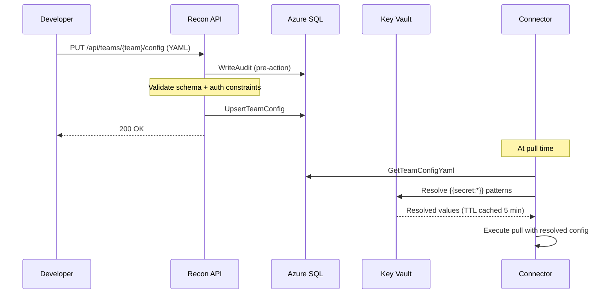
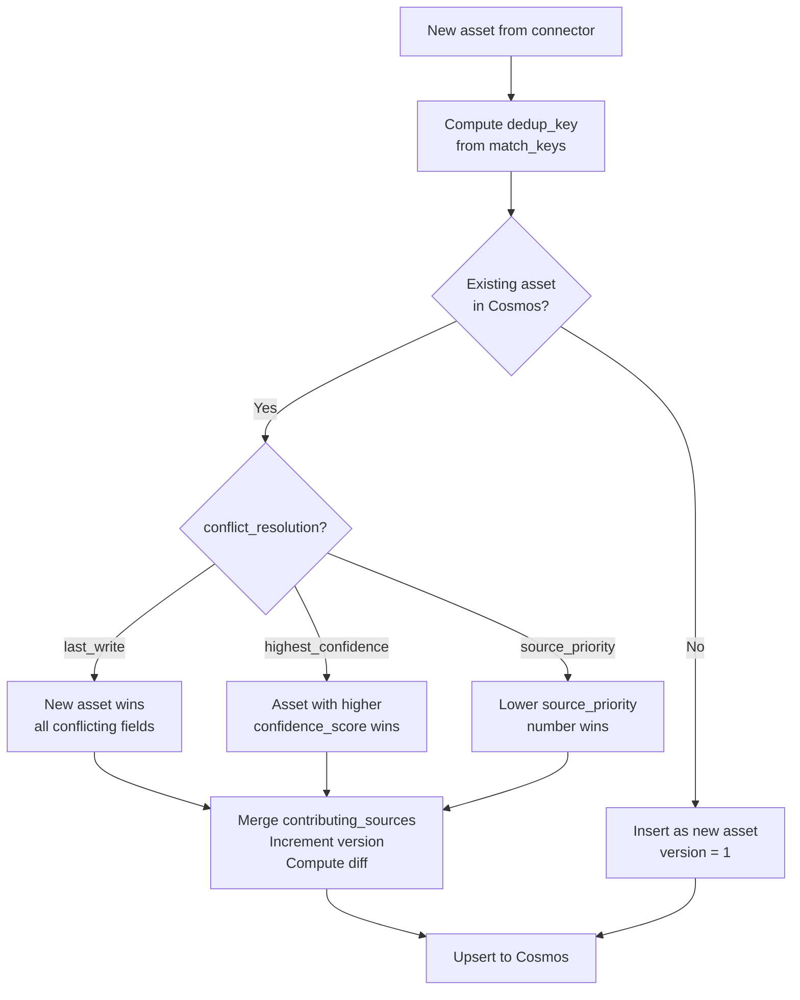

# Team Configuration Reference

This document covers every field in a team's YAML configuration, how configuration is loaded and resolved, and complete working examples for each connector type.

---

## 1. Overview

A **team config** is a YAML document that tells the platform:

- Which data sources the team owns (REST APIs, Azure SQL, ADX, custom plugins)
- How to authenticate to each source
- Which fields to extract and how to map them to canonical asset fields
- How to deduplicate assets seen across multiple sources
- How stale (outdated) data is detected

**Where it is stored:** The YAML is stored as a string in the `team_configs` table in Azure SQL Serverless (`config_yaml` column). It is never stored as a file on disk in production.

**How it is loaded:** At pull time, the Connector Worker reads the YAML from SQL, then resolves all `{{secret:KEY_NAME}}` patterns by fetching values from Azure Key Vault. The resolved config is held in memory for the duration of the pull and never persisted.

**How to update a config:** Send a `PUT /api/teams/{team}/config` request with the new YAML body. The API validates the schema, writes an audit log entry, and upserts to SQL. No restart is required — the next pull will use the new config.

---

## Config Load Flow



---

## 2. Full YAML Schema

```yaml
team: <string>                    # Team identifier — must match Entra ID app registration name
stale_after_days: <int>           # Default staleness threshold for all sources (overridable per source)

auth:
  entra_app_id: "{{secret:KEY}}"  # Entra ID App Registration ID for this team
  tenant_id: "{{secret:KEY}}"     # Azure Tenant ID

dedup:
  default_conflict_resolution: <strategy>   # last_write | highest_confidence | source_priority
  custom_resolver: <class_path>             # optional: fully-qualified plugin class

sources:
  - id: <string>                  # Unique source identifier within this team config
    type: <connector_type>        # rest_api | azure_sql | azure_adx | plugin
    stale_after_days: <int>       # Override team-level staleness for this source
    rate_limit_per_minute: <int>  # Max API calls per minute (default: 60)
    mapping:                      # Field mapping from raw source to canonical asset
      <canonical_field>: <JSONPath or column name>
    dedup:
      match_keys: [<field>, ...]  # Fields that identify a unique asset
      conflict_resolution: <strategy>
      source_priority: <int>      # Lower = higher priority (used with source_priority strategy)
    catalog:                      # Optional: named queries for the agent (see source-catalog.md)
      description: <string>
      queries: [...]
```

**Top-level fields:**

| Field | Type | Required | Default | Description |
|---|---|---|---|---|
| `team` | string | Yes | — | Unique team name. Must match the Entra ID app registration name used for JWT validation. |
| `stale_after_days` | int | No | 7 | Assets older than this many days are marked stale and queued for refresh. |
| `auth.entra_app_id` | secret ref | Yes | — | Entra App ID for team authentication. Always a `{{secret:...}}` reference. |
| `auth.tenant_id` | secret ref | Yes | — | Azure tenant ID. |
| `dedup.default_conflict_resolution` | enum | No | `last_write` | Default dedup strategy when a source does not override it. |
| `dedup.custom_resolver` | string | No | null | Fully-qualified C# class path implementing `IDeduplicationResolver`. Must be in `plugins/` directory. |
| `sources` | list | Yes | — | One or more source definitions. |

**Per-source fields:**

| Field | Type | Required | Default | Description |
|---|---|---|---|---|
| `id` | string | Yes | — | Stable identifier used in logs, Blob paths, and Service Bus messages. |
| `type` | enum | Yes | — | `rest_api`, `azure_sql`, `azure_adx`, or `plugin`. |
| `stale_after_days` | int | No | team-level value | Per-source override. A fast-changing source like a vuln DB might set `1`. |
| `rate_limit_per_minute` | int | No | 60 | Throttle applied by the connector before each API call. |
| `mapping` | object | No | — | Maps raw source field names (or JSONPath) to canonical asset field names. |
| `dedup.match_keys` | list | Yes | — | Fields used to compute the dedup key. Must be present in `mapping` output. |
| `dedup.conflict_resolution` | enum | No | team default | Per-source override: `last_write`, `highest_confidence`, `source_priority`. |
| `dedup.source_priority` | int | No | 50 | Numeric priority (lower = higher). Used when `conflict_resolution: source_priority`. |

---

## 3. Source Types

### REST API Source

Use this for any HTTP-based data source that returns JSON. Supports OAuth2 client credentials, API key, and Bearer token authentication. Supports pagination.

```yaml
sources:
  - id: asset-inventory-api
    type: rest_api
    stale_after_days: 3
    rate_limit_per_minute: 30
    base_url: https://internal-api.corp.com/assets
    auth:
      type: oauth2
      token_url: https://login.microsoftonline.com/{{secret:AZURE_TENANT_ID}}/oauth2/v2.0/token
      client_id: "{{secret:ASSET_API_CLIENT_ID}}"
      client_secret: "{{secret:ASSET_API_CLIENT_SECRET}}"
      scope: api://asset-api/.default
    pagination:
      style: cursor              # cursor | offset | none
      cursor_path: "$.meta.next_cursor"
      page_size: 200
    mapping:
      host: "$.data[*].hostname"
      ip: "$.data[*].ip_address"
      owner: "$.data[*].team"
      severity: "$.data[*].risk_level"
      tags: "$.data[*].labels"
    dedup:
      match_keys: [host, ip]
      conflict_resolution: source_priority
      source_priority: 10
    catalog:
      description: "Internal asset inventory REST API"
      queries:
        - id: hosts_by_team
          description: "Return all hosts owned by a given team"
          template: "/assets?owner={owner_team}&limit={limit}"
          parameters:
            - name: owner_team
              type: string
              description: "Team short name, e.g. network-security"
            - name: limit
              type: int
              default: "100"
              description: "Max results per page"
          output_fields:
            - name: hostname
              type: string
              maps_to: asset.hostname
            - name: ip_address
              type: string
              maps_to: asset.ip
```

### Azure SQL Source

Use this for data in Azure SQL databases. The query must be a parameterized SQL SELECT. No DDL, stored procedures, or dynamic SQL.

```yaml
sources:
  - id: vuln-db
    type: azure_sql
    stale_after_days: 1
    connection_string: "{{secret:VULN_DB_CONN_STRING}}"
    query: |
      SELECT host, cve_id AS finding, severity, discovered_at
      FROM findings
      WHERE active = 1
        AND team = 'network-security'
    mapping:
      host: host
      finding: finding
      severity: severity
    dedup:
      match_keys: [host, finding]
      conflict_resolution: source_priority
      source_priority: 5
```

The `connection_string` must be a `{{secret:...}}` reference — never a plaintext connection string. The connector uses parameterized queries only; no string interpolation is performed on the `query` field value.

### Azure ADX (Data Explorer) Source

Use this for data in Azure Data Explorer clusters. Queries are written in KQL (Kusto Query Language).

```yaml
sources:
  - id: network-telemetry
    type: azure_adx
    stale_after_days: 7
    cluster: https://telemetry.eastus.kusto.windows.net
    database: NetworkLogs
    query: |
      NetworkFlows
      | where timestamp > ago(7d)
      | summarize by src_ip, dst_ip, protocol
      | project ip = src_ip
    auth:
      type: managed_identity      # preferred in Azure — no secret needed
    mapping:
      ip: ip
    dedup:
      match_keys: [ip]
      conflict_resolution: last_write
    catalog:
      description: "Network flow telemetry from ADX"
      queries:
        - id: flows_by_subnet
          description: "Return flows from a given source subnet"
          template: |
            NetworkFlows
            | where src_ip startswith '{subnet_prefix}'
            | where {extra_filter}
            | summarize by src_ip, dst_ip
          parameters:
            - name: subnet_prefix
              type: string
              description: "IP prefix, e.g. '10.0.1.'"
            - name: extra_filter
              type: kql_expression
              default: "1 == 1"
              description: "Optional KQL filter"
          output_fields:
            - name: src_ip
              type: string
              maps_to: asset.ip
```

### Plugin Connector Source

Use this for custom data sources that do not fit REST, SQL, or ADX. The plugin class must implement `IConnector` and live in the `plugins/` directory.

```yaml
sources:
  - id: custom-cmdb
    type: plugin
    plugin_class: plugins.CmdbConnector    # class path relative to plugins/ directory
    stale_after_days: 14
    config:
      endpoint: https://cmdb.internal/api
      api_version: v2
    mapping:
      host: asset_name
      owner: asset_owner
      tags: business_unit
    dedup:
      match_keys: [host]
      conflict_resolution: last_write
```

Plugin paths are restricted to the `plugins/` directory. Any path that attempts directory traversal (e.g., `../SomeClass`) is rejected by `PluginLoader` before loading.

---

## 4. Auth Methods

| `auth.type` | Required Fields | When to Use |
|---|---|---|
| `oauth2` | `token_url`, `client_id`, `client_secret`, `scope` | REST APIs that use OAuth2 client credentials flow (most Azure services in non-managed-identity scenarios) |
| `api_key` | `header_name`, `api_key` | REST APIs that use API key in a header (e.g., `X-API-Key`) |
| `bearer` | `token` | REST APIs that accept a static Bearer token |
| `managed_identity` | (none) | Azure services (ADX, SQL, Blob) when the Connector Worker has managed identity access to the resource |
| `connection_string` | `connection_string` | Azure SQL when managed identity is not available |

**Managed identity is always preferred** for Azure-to-Azure connections because it requires no secrets and rotates automatically. Use `oauth2` or `api_key` only for external third-party APIs.

---

## 5. Deduplication Config

The deduplication engine runs before every upsert to Cosmos DB. Its job is to detect whether an incoming asset matches an existing one and resolve conflicting field values.

### How it works



### Config fields

| Field | Type | Required | Default | Description |
|---|---|---|---|---|
| `match_keys` | list of strings | Yes | — | Fields used to compute the dedup key. The dedup key is `type::field1_value::field2_value`. |
| `conflict_resolution` | enum | No | team default | `last_write`, `highest_confidence`, or `source_priority`. |
| `source_priority` | int | No | 50 | Lower number = higher priority. Only used when `conflict_resolution: source_priority`. |
| `custom_resolver` | string | No | null | Plugin class path (team-level only). Must implement `IDeduplicationResolver`. |

### Conflict resolution strategies

| Strategy | Behavior | Best used when |
|---|---|---|
| `last_write` | The most recently pulled value always wins for any conflicting field. | All sources are equally authoritative; you just want the freshest data. |
| `highest_confidence` | The source with the higher `confidence_score` field wins. | Sources have explicit quality scores (e.g., a scanner that rates its own findings). |
| `source_priority` | The source with the lower `source_priority` number wins for conflicting fields. | You have a golden source (e.g., CMDB = priority 1) and supplementary sources (scanner = priority 10). |

### Custom resolver

For teams with complex merge logic, a custom resolver can be registered:

```yaml
dedup:
  default_conflict_resolution: source_priority
  custom_resolver: plugins.dedup.NetworkSecurityDeduplicator
```

The class must implement `IDeduplicationResolver` in `ReconPlatform.Engine.Interfaces`. See `plugins/ExamplePlugin.cs` for a starter template.

---

## 6. Source Catalog

The source catalog is an optional `catalog` block inside each source. It defines named queries that the AI agent can execute. Without a catalog, the source is pulled on a schedule but is not available for agent queries.

See `docs/source-catalog.md` for the full catalog schema.

**Quick example:**

```yaml
sources:
  - id: my-adx-source
    type: azure_adx
    ...
    catalog:
      description: "Short description of what this source contains"
      queries:
        - id: my_query_name
          description: "What this query returns — the agent reads this"
          template: |
            MyTable
            | where team == '{team_name}'
          parameters:
            - name: team_name
              type: string
              description: "Team to filter by"
          output_fields:
            - name: hostname
              type: string
              maps_to: asset.hostname
```

---

## 7. Rate Limiting

Each source can declare a maximum number of API calls per minute:

```yaml
sources:
  - id: rate-limited-api
    type: rest_api
    rate_limit_per_minute: 10    # only 10 requests/minute to this source
```

The connector enforces this with a token bucket. If the rate limit is hit, the connector waits and retries. Rate limiting is applied per source per Connector Worker instance. If KEDA scales to multiple workers, each worker independently respects the limit.

Rate limiting per connector is currently implemented in v1 via Polly. Cross-worker coordination (global rate limiting) is deferred to v2.

---

## 8. Stale Detection

Staleness works at two levels:

**Team-level default** — applies to all sources that do not set their own value:

```yaml
team: network-security
stale_after_days: 7    # any asset not pulled in 7 days is stale
```

**Per-source override** — for sources where data changes more (or less) frequently:

```yaml
sources:
  - id: vuln-db
    stale_after_days: 1   # vulnerability data must be refreshed daily
  - id: cmdb
    stale_after_days: 30  # CMDB data changes slowly
```

The Staleness Timer worker runs every 6 hours and queries Cosmos for assets where:

```
last_pulled < NOW() - stale_after_days  AND  is_stale = false
```

Matching assets are marked `is_stale = true` and enqueued on Service Bus. The Connector Worker then pulls fresh data, resets `is_stale = false`, and increments the asset version.
