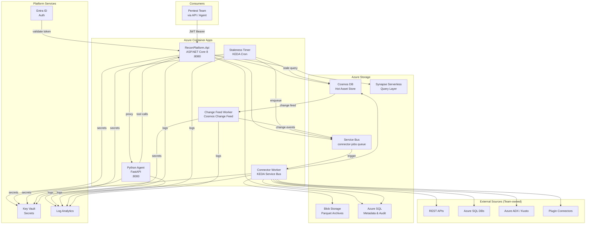
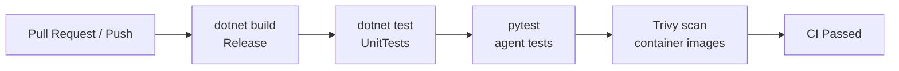

# Production Deployment Guide

This guide walks you through deploying the Recon Intelligence Platform to Azure for the first time and explains ongoing CI/CD operations.

---

## 1. Architecture Overview



Every component runs in Azure Container Apps (Consumption plan) which scales to zero when idle, minimizing cost. Workers are triggered by KEDA (Kubernetes Event-Driven Autoscaler) using Service Bus message count.

---

## 2. Prerequisites

**Azure permissions required:**

| Role | Where | Why |
|---|---|---|
| Contributor | Resource Group | Create and manage all Azure resources |
| User Access Administrator | Resource Group | Assign managed identity roles to Container Apps |
| Key Vault Administrator | Subscription or RG | Create Key Vault and set secrets |

**Tools required on your local machine:**

```bash
az --version          # Azure CLI 2.58+
bicep --version       # Bicep CLI (installed via az bicep install)
docker --version      # Docker 24+

# Install Bicep CLI
az bicep install
```

**One-time Azure setup:**

```bash
# Login to Azure
az login

# Set your subscription
az account set --subscription "your-subscription-id"

# Create Entra ID app registration for each team (repeat per team)
az ad app create --display-name "recon-team-alpha" --sign-in-audience AzureADMyOrg
```

---

## 3. One-Time Infrastructure Setup

All Azure resources are defined as Bicep templates in `infra/`. You deploy them once; updates are applied by re-running the same command.

```bash
# Create the resource group
az group create --name rg-recon-prod --location eastus2

# Preview what will be created (no changes made)
az deployment group what-if \
  --resource-group rg-recon-prod \
  --template-file infra/main.bicep \
  --parameters @infra/main.prod.parameters.json

# Deploy all resources (~10-15 minutes first time)
az deployment group create \
  --resource-group rg-recon-prod \
  --template-file infra/main.bicep \
  --parameters @infra/main.prod.parameters.json \
  --output table
```

**Note the outputs** from the deployment — you will need them in step 4:

| Output | What it is |
|---|---|
| `acrLoginServer` | Container Registry URL (e.g. `reconacr.azurecr.io`) |
| `apiContainerAppFqdn` | Public URL of the API |
| `agentContainerAppFqdn` | Internal URL of the Python agent |
| `keyVaultName` | Key Vault name for storing secrets |

**After first deploy, populate Key Vault secrets:**

```bash
KV=your-keyvault-name   # from deployment output

# Example: add Cosmos connection info
az keyvault secret set --vault-name $KV --name COSMOS-ENDPOINT --value "https://..."
az keyvault secret set --vault-name $KV --name SQL-CONN-STRING --value "Server=..."

# Add team-specific secrets
az keyvault secret set --vault-name $KV --name ASSET-API-CLIENT-ID --value "..."
az keyvault secret set --vault-name $KV --name ASSET-API-CLIENT-SECRET --value "..."
```

Secret naming convention: use hyphens in Key Vault names (e.g. `ASSET-API-CLIENT-ID`). The `SecretResolver` translates `{{secret:ASSET_API_CLIENT_ID}}` to Key Vault secret name `ASSET-API-CLIENT-ID` automatically.

---

## 4. Build and Push Container Images

Each component has its own `Dockerfile`. You build and push to Azure Container Registry (ACR), then update the Container App to use the new image.

```bash
ACR=reconacr.azurecr.io   # from deployment output

# Login to ACR
az acr login --name reconacr

# Build and push the API image
docker build -t $ACR/recon-api:latest -f src/ReconPlatform.Api/Dockerfile .
docker push $ACR/recon-api:latest

# Build and push the Python agent
docker build -t $ACR/recon-agent:latest -f agent/Dockerfile .
docker push $ACR/recon-agent:latest

# Build and push the workers (single image, WORKER_TYPE env var selects which worker)
docker build -t $ACR/recon-workers:latest -f src/ReconPlatform.Workers/Dockerfile .
docker push $ACR/recon-workers:latest

# Update the Container Apps to use the new images
az containerapp update \
  --name recon-api \
  --resource-group rg-recon-prod \
  --image $ACR/recon-api:latest

az containerapp update \
  --name recon-agent \
  --resource-group rg-recon-prod \
  --image $ACR/recon-agent:latest

az containerapp update \
  --name recon-connector-worker \
  --resource-group rg-recon-prod \
  --image $ACR/recon-workers:latest
```

---

## 5. CI/CD Pipeline

The repository includes `.github/workflows/ci.yml` which runs on every push and pull request.

**What the CI workflow does:**



**Adding CD (Continuous Deployment) to the CI workflow:**

Add a new job to `.github/workflows/ci.yml` that runs only on push to `main`:

```yaml
deploy:
  needs: [build, test]
  runs-on: ubuntu-latest
  if: github.ref == 'refs/heads/main'
  steps:
    - uses: actions/checkout@v4

    - name: Azure Login
      uses: azure/login@v2
      with:
        creds: ${{ secrets.AZURE_CREDENTIALS }}

    - name: Login to ACR
      run: az acr login --name reconacr

    - name: Build and push API
      run: |
        docker build -t reconacr.azurecr.io/recon-api:${{ github.sha }} -f src/ReconPlatform.Api/Dockerfile .
        docker push reconacr.azurecr.io/recon-api:${{ github.sha }}

    - name: Deploy to Container App
      run: |
        az containerapp update \
          --name recon-api \
          --resource-group rg-recon-prod \
          --image reconacr.azurecr.io/recon-api:${{ github.sha }}
```

Add `AZURE_CREDENTIALS` as a GitHub secret (use `az ad sp create-for-rbac --sdk-auth` to generate the value).

---

## 6. Environment Variables and Secrets

**Rule:** secrets go into Key Vault; non-secret configuration goes into Container App environment variables.

| Variable | Where it goes | Why |
|---|---|---|
| `COSMOS_ENDPOINT` | Container App env var | Not a secret — it's a public endpoint URL |
| `COSMOS_DATABASE` | Container App env var | Not a secret |
| `BLOB_ACCOUNT_URL` | Container App env var | Not a secret |
| `SQL_CONNECTION_STRING` | Key Vault → Container App secret reference | Contains credentials |
| `ANTHROPIC_API_KEY` | Key Vault → Container App secret reference | API key |
| `AZURE_OPENAI_API_KEY` | Key Vault → Container App secret reference | API key |
| `SERVICEBUS_NAMESPACE` | Container App env var | Managed identity is used — no key needed |
| `WORKER_TYPE` | Container App env var | Selects which worker runs in this container |

**Referencing Key Vault secrets in Container Apps:**

```bash
az containerapp secret set \
  --name recon-api \
  --resource-group rg-recon-prod \
  --secrets "sql-conn=keyvaultref:https://recon-kv.vault.azure.net/secrets/SQL-CONN-STRING"

az containerapp update \
  --name recon-api \
  --resource-group rg-recon-prod \
  --set-env-vars "SQL_CONNECTION_STRING=secretref:sql-conn"
```

The Container App's managed identity must have `Key Vault Secrets User` role on the Key Vault.

---

## 7. Zero-Downtime Deployment

Azure Container Apps supports blue/green deployments using **revisions**. Each `az containerapp update` creates a new revision. Configure traffic splitting to gradually shift traffic:

```bash
# Deploy new image as a new revision (gets 0% traffic initially)
az containerapp update \
  --name recon-api \
  --resource-group rg-recon-prod \
  --image reconacr.azurecr.io/recon-api:v2 \
  --revision-suffix v2

# Send 10% of traffic to the new revision for canary testing
az containerapp ingress traffic set \
  --name recon-api \
  --resource-group rg-recon-prod \
  --revision-weight recon-api--v1=90 recon-api--v2=10

# After validation, shift all traffic
az containerapp ingress traffic set \
  --name recon-api \
  --resource-group rg-recon-prod \
  --revision-weight recon-api--v2=100
```

---

## 8. Rollback Procedure

If a deployment causes issues, activate the previous revision immediately:

```bash
# List all revisions and find the previous healthy one
az containerapp revision list \
  --name recon-api \
  --resource-group rg-recon-prod \
  --output table

# Activate the previous revision and send all traffic to it
az containerapp ingress traffic set \
  --name recon-api \
  --resource-group rg-recon-prod \
  --revision-weight recon-api--v1=100

# Deactivate the broken revision
az containerapp revision deactivate \
  --name recon-api \
  --resource-group rg-recon-prod \
  --revision recon-api--v2
```

Rollback takes effect within seconds. No data is lost — the storage layer (Cosmos, Blob, SQL) is separate from the compute layer.

---

## 9. Scaling

**API and Agent** scale based on HTTP request concurrency (built into Container Apps):

```bash
az containerapp update \
  --name recon-api \
  --resource-group rg-recon-prod \
  --min-replicas 1 \
  --max-replicas 10 \
  --scale-rule-name http-scaling \
  --scale-rule-type http \
  --scale-rule-http-concurrency 50
```

**Connector Worker** scales based on Service Bus queue depth (KEDA):

The KEDA trigger is configured in the Bicep template (`infra/containerapp.bicep`). Key tuning parameters:

| Parameter | Default | When to increase |
|---|---|---|
| `messageCount` | 5 | Number of Service Bus messages per replica. Lower = more aggressive scaling. |
| `maxReplicas` | 10 | Max concurrent connector workers. Raise if you have many teams and sources. |
| `pollingInterval` | 30 | Seconds between KEDA checks. Lower for faster scale-up reaction. |

To update KEDA settings:

```bash
az containerapp update \
  --name recon-connector-worker \
  --resource-group rg-recon-prod \
  --scale-rule-name servicebus \
  --scale-rule-type azure-servicebus \
  --scale-rule-metadata "queueName=retrigger-jobs" "messageCount=5" "namespace=recon-sb"
```

---

## 10. Health Checks

**API health endpoint:**

```
GET /api/health
```

Response format:

```json
{
  "status": "healthy",
  "cosmos": "ok",
  "sql": "ok",
  "blob": "ok",
  "serviceBus": "ok",
  "timestamp": "2026-06-02T10:00:00Z"
}
```

If any component is unhealthy, the response is `503` with the failing component marked `"degraded"` or `"unavailable"`.

**Azure Container Apps health probe configuration** (from `infra/containerapp.bicep`):

```bicep
probes: [
  {
    type: 'Liveness'
    httpGet: {
      path: '/api/health'
      port: 8080
    }
    initialDelaySeconds: 10
    periodSeconds: 30
    failureThreshold: 3
  }
  {
    type: 'Readiness'
    httpGet: {
      path: '/api/health'
      port: 8080
    }
    initialDelaySeconds: 5
    periodSeconds: 10
    failureThreshold: 2
  }
]
```

Container Apps will automatically restart the container if the liveness probe fails 3 consecutive times, and will stop routing traffic if readiness fails.
