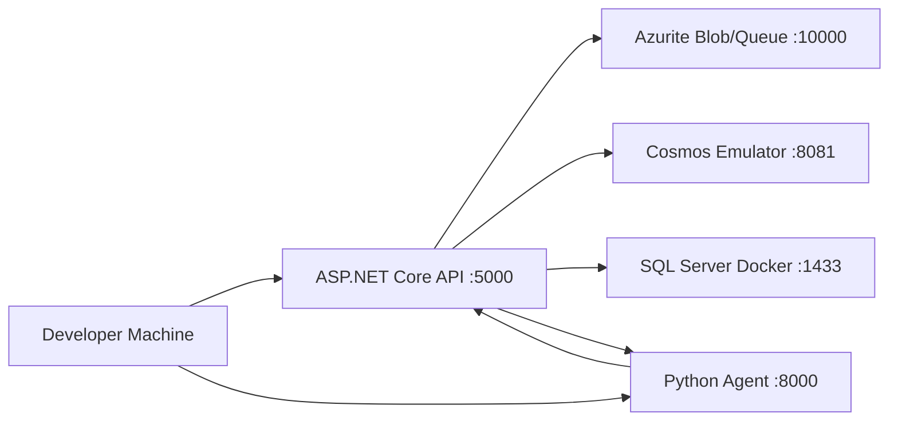

# Local Development Setup Guide

This guide gets you from a fresh machine to a fully running Recon Intelligence Platform in under 30 minutes. It targets developers who have basic Azure familiarity but have never worked in this codebase before.

---

## Local Development Architecture



The API and workers talk to local emulators instead of real Azure services. The Python agent proxies through the API. You can run the API and agent independently.

---

## 1. Prerequisites

Install these exact versions before continuing. Mismatched versions cause subtle build failures.

| Tool | Required Version | Install |
|---|---|---|
| .NET SDK | 8.0.x (latest 8.x) | https://dotnet.microsoft.com/download/dotnet/8.0 |
| Python | 3.11 or 3.12 | https://www.python.org/downloads/ |
| Docker Desktop | 4.x | https://www.docker.com/products/docker-desktop/ |
| Azure CLI | 2.58+ | `winget install Microsoft.AzureCLI` or https://aka.ms/installazurecliwindows |
| Git | Any recent | https://git-scm.com/ |
| Make | Any | Windows: `winget install GnuWin32.Make` / macOS: `brew install make` |

**VS Code Extensions** (install all for the best experience):

| Extension ID | Purpose |
|---|---|
| `ms-dotnettools.csharp` | C# language support |
| `ms-dotnettools.csdevkit` | Solution explorer, test runner |
| `ms-python.python` | Python language support |
| `ms-python.vscode-pylance` | Python type checking |
| `humao.rest-client` | Test API endpoints from `.http` files |
| `ms-azuretools.vscode-docker` | Docker Compose integration |
| `redhat.vscode-yaml` | Skill YAML authoring with schema hints |

Verify your setup:

```bash
dotnet --version   # must show 8.0.x
python --version   # must show 3.11.x or 3.12.x
docker --version
az --version       # must show 2.58+
```

---

## 2. Clone and First Build

```bash
# Clone the repository
git clone https://github.com/your-org/recon-platform.git
cd recon-platform

# Restore .NET packages and build everything
dotnet restore ReconPlatform.sln
dotnet build ReconPlatform.sln --configuration Release

# Verify all unit tests pass (no Azure resources needed)
dotnet test tests/ReconPlatform.UnitTests --configuration Release

# Install Python dependencies
cd agent
pip install -r requirements.txt
cd ..
```

Expected output: `Build succeeded` with zero warnings. The project enforces `TreatWarningsAsErrors`, so any warning is a build failure.

---

## 3. Local Azure Resources

You have two options. **Option A is recommended for first-time setup** — it requires no Azure subscription.

### Option A: Local Emulators (Recommended)

This uses free local emulators for Blob Storage, Cosmos DB, and SQL Server. No Azure account needed.

```bash
# Start all local services in one command
docker compose up -d

# Verify they are running
docker compose ps
```

The `docker-compose.yml` at the repo root starts:

| Service | Port | What it emulates |
|---|---|---|
| Azurite | 10000 (Blob), 10001 (Queue), 10002 (Table) | Azure Blob Storage + Queue |
| Cosmos DB Emulator | 8081 | Azure Cosmos DB |
| SQL Server 2022 | 1433 | Azure SQL Serverless |

**Initialize the SQL schema** (run once after first `docker compose up`):

```bash
dotnet run --project src/ReconPlatform.Api -- --migrate-only
```

This applies the schema (team_configs, connector_run_log, engagements, user_permissions, audit_log tables) and exits.

### Option B: Real Azure Resources

Follow `docs/deployment.md` to provision real Azure resources with Bicep, then use the real connection strings from the Azure portal in step 4 below.

---

## 4. `.env` Setup

Copy the example file and fill in the values:

```bash
cp .env.example .env
```

Open `.env` in your editor. Every variable is explained below:

| Variable | Where to get it | Local dev value |
|---|---|---|
| `AZURE_KEYVAULT_URL` | Azure portal → your Key Vault → Vault URI. **Leave blank** for pure local dev — the app falls back to env vars. | (leave blank) |
| `AZURE_CLIENT_ID` | Entra ID → App registrations → your app → Application ID | `a1b2c3d4-...` |
| `AZURE_CLIENT_SECRET` | Entra ID app → Certificates & secrets → New client secret | `abc123~...` |
| `AZURE_TENANT_ID` | Entra ID → Overview → Tenant ID | `e5f6g7h8-...` |
| `COSMOS_ENDPOINT` | Local emulator default | `https://localhost:8081` |
| `COSMOS_DATABASE` | Fixed app name | `recon` |
| `BLOB_ACCOUNT_URL` | Azurite default | `http://127.0.0.1:10000/devstoreaccount1` |
| `BLOB_CONTAINER` | Fixed app name | `recon-raw` |
| `SQL_CONNECTION_STRING` | Local Docker SQL | `Server=localhost,1433;Database=ReconOps;User Id=sa;Password=YourPassword123!;TrustServerCertificate=true` |
| `SYNAPSE_CONNECTION_STRING` | Same as SQL for local dev | same as SQL above |
| `SERVICEBUS_NAMESPACE` | Azure portal → Service Bus → Host name | `recon-sb.servicebus.windows.net` |
| `SERVICEBUS_QUEUE` | Fixed name | `retrigger-jobs` |
| `WORKER_TYPE` | Which worker this process runs | `connector-worker` |
| `AGENT_LLM_PROVIDER` | `anthropic` or `azure_openai` | `anthropic` |
| `ANTHROPIC_API_KEY` | https://console.anthropic.com → API Keys | `sk-ant-...` |
| `AZURE_OPENAI_ENDPOINT` | Azure portal → Azure OpenAI → Endpoint | `https://....openai.azure.com/` |
| `AZURE_OPENAI_DEPLOYMENT` | Your deployment name in Azure OpenAI Studio | `gpt-4o` |
| `AZURE_OPENAI_API_KEY` | Azure portal → Azure OpenAI → Keys | `abc123...` |

**Minimal `.env` for pure local dev (no Azure subscription):**

```env
COSMOS_ENDPOINT=https://localhost:8081
COSMOS_DATABASE=recon
BLOB_ACCOUNT_URL=http://127.0.0.1:10000/devstoreaccount1
BLOB_CONTAINER=recon-raw
SQL_CONNECTION_STRING=Server=localhost,1433;Database=ReconOps;User Id=sa;Password=YourPassword123!;TrustServerCertificate=true
SYNAPSE_CONNECTION_STRING=Server=localhost,1433;Database=ReconOps;User Id=sa;Password=YourPassword123!;TrustServerCertificate=true
SERVICEBUS_NAMESPACE=localhost
SERVICEBUS_QUEUE=retrigger-jobs
AGENT_LLM_PROVIDER=anthropic
ANTHROPIC_API_KEY=sk-ant-YOUR_KEY_HERE
```

---

## 5. Running the API Locally

```bash
# From the repo root
dotnet run --project src/ReconPlatform.Api

# Or using make
make api
```

The API starts on `http://localhost:5000`. Open Swagger UI at:

```
http://localhost:5000/swagger
```

**Getting a local JWT for testing:**

All API endpoints except `GET /api/health` require a Bearer token. For local development:

```bash
# Option 1: use the built-in dev token (only works when ASPNETCORE_ENVIRONMENT=Development)
# In Swagger UI, click "Authorize" and enter:
Bearer dev-token-team-alpha

# Option 2: get a real Entra ID token via Azure CLI
az account get-access-token --resource <your-api-app-id> --query accessToken -o tsv
```

The dev token bypass is only active when `ASPNETCORE_ENVIRONMENT=Development`. It is stripped out in production builds.

**Verify the API is working:**

```bash
curl http://localhost:5000/api/health
# Expected: {"status":"healthy","cosmos":"ok","sql":"ok","blob":"ok","serviceBus":"ok"}
```

---

## 6. Running the Python Agent

The agent is a separate FastAPI service. Run it in a second terminal.

```bash
cd agent

# Install dependencies (only needed once)
pip install -r requirements.txt
# or: make agent-install

# Start with auto-reload on file changes
uvicorn main:app --reload --host 0.0.0.0 --port 8000
# or: make agent
```

Agent Swagger UI: `http://localhost:8000/docs`

The C# API reads `AGENT_SERVICE_URL` from config (default `http://localhost:8000`) and proxies `POST /api/agent/query` to the agent. Both services must be running for agent queries to work.

---

## 7. Running Workers

Workers are background jobs that pull data, detect staleness, and react to Cosmos changes. In production they run as separate Container Apps. Locally they are a single `ReconPlatform.Workers` project that reads `WORKER_TYPE` to decide which worker to run.

| Worker | `WORKER_TYPE` | What it does | When you need it locally |
|---|---|---|---|
| Connector Worker | `connector-worker` | Dequeues Service Bus messages, calls connectors, writes to Blob + Cosmos | Testing end-to-end data pulls |
| Staleness Timer | `staleness-timer` | Every 6 hours: finds stale assets in Cosmos, enqueues retrigger jobs | Testing stale detection logic |
| Change Feed Worker | `change-feed` | Polls Cosmos change feed, fires skills on asset changes | Testing skill execution |

```bash
# Run a specific worker
WORKER_TYPE=connector-worker dotnet run --project src/ReconPlatform.Workers

# Or using make
make worker-connector
make worker-staleness
make worker-changefeed
```

You only need the worker relevant to what you are testing. Most feature work only needs the API running.

---

## 8. Running Tests

```bash
# C# unit tests (fast, no Docker required)
make test
# or: dotnet test tests/ReconPlatform.UnitTests --configuration Release --logger "console;verbosity=normal"

# C# integration tests (requires docker compose up)
make integration-test

# Python agent tests
make agent-test
# or: cd agent && pytest

# Run everything
make all-tests
```

**What each test suite covers:**

| Suite | Location | What it tests | Docker needed? |
|---|---|---|---|
| Unit tests | `tests/ReconPlatform.UnitTests/` | Config parsing, dedup engine, normalizer, diff engine, secret resolver, scope enforcement rules | No |
| Integration tests | `tests/ReconPlatform.IntegrationTests/` | Full API controller tests, end-to-end pull cycle, skill registration, audit log writes | Yes |
| Agent tests | `agent/tests/` | Query builder, tool dispatch, scope enforcement in Python, LLM mock responses | No |

All tests use mocked Azure SDK calls — no real Azure services are called during testing.

---

## 9. Common Issues

| Problem | Cause | Fix |
|---|---|---|
| `dotnet build` fails with `CS0234: namespace 'Cosmos'` | NuGet packages not restored | Run `dotnet restore ReconPlatform.sln` again; check internet connectivity |
| `Connection refused :8081` (Cosmos emulator) | Docker Desktop not running or emulator still initializing | Run `docker compose up -d` and wait 60 seconds for the Cosmos emulator to be ready |
| SSL certificate error connecting to Cosmos emulator | Emulator uses a self-signed certificate | Add `COSMOS_EMULATOR_DISABLE_SSL_VERIFICATION=true` to `.env`, or trust the cert: `curl -k https://localhost:8081/_explorer/emulator.pem > emulator.pem && certutil -addstore root emulator.pem` (Windows) |
| `Login failed for user 'sa'` on local SQL | Docker SQL not started, or SA password mismatch | Ensure `docker compose up -d` ran successfully; check `SA_PASSWORD` in `docker-compose.yml` matches `SQL_CONNECTION_STRING` in `.env` |
| `401 Unauthorized` on all API calls | Missing or invalid Bearer token | In Swagger UI, click Authorize and paste `Bearer dev-token-team-alpha` (only works in Development environment) |
| `403 Forbidden` on team endpoints | JWT `team` claim does not match the team in the URL path | Use the correct dev token for the team, e.g. `dev-token-team-alpha` for `/api/teams/alpha/...` |
| `ANTHROPIC_API_KEY not set` at agent startup | Agent started without the API key in env | Set `ANTHROPIC_API_KEY` in `.env` and restart the agent |
| Python agent returns `Connection refused` when calling tools | C# API is not running, or URL mismatch | Start the API first (`make api`), then start the agent. Check `RECON_API_BASE_URL` in `agent/config.yaml` |
| `YamlDotNet.Core.SyntaxErrorException` loading team config | YAML has tab characters instead of spaces | YAML requires spaces only. The VS Code YAML extension highlights this; run `cat -A config.yaml \| grep $'\t'` to find tabs |
| `DeduplicationEngine: field 'x' not in asset` | A field listed in `dedup.match_keys` is not produced by the source `mapping` | Check the source's `mapping` block — every key in `match_keys` must appear as a mapped output field |
